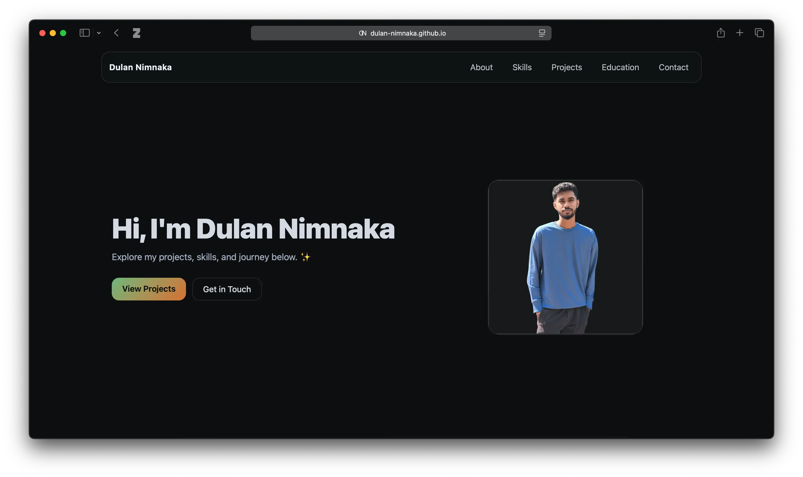
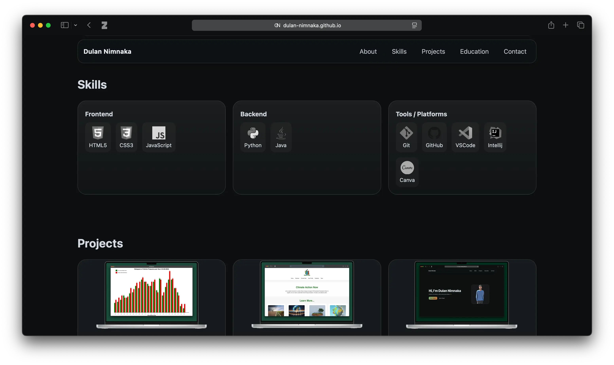
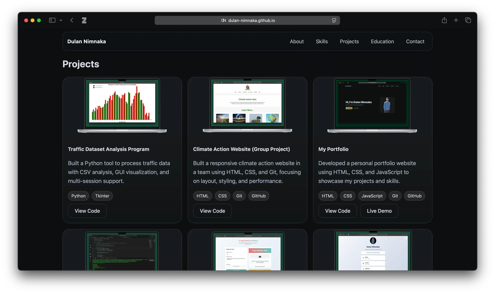
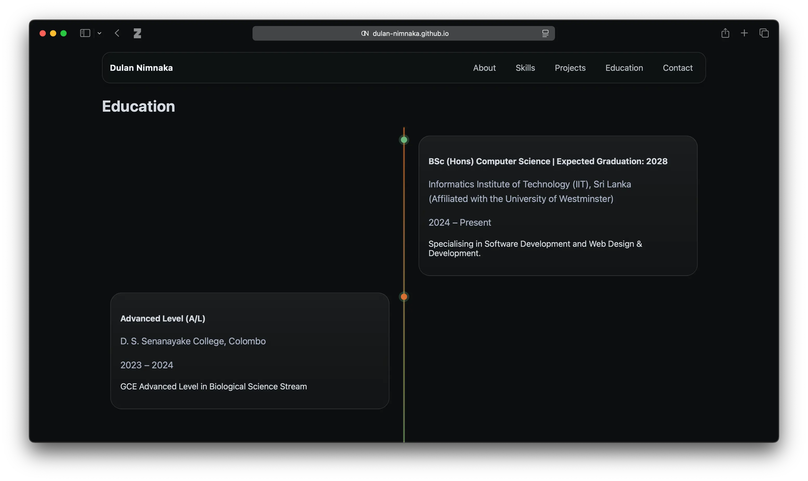
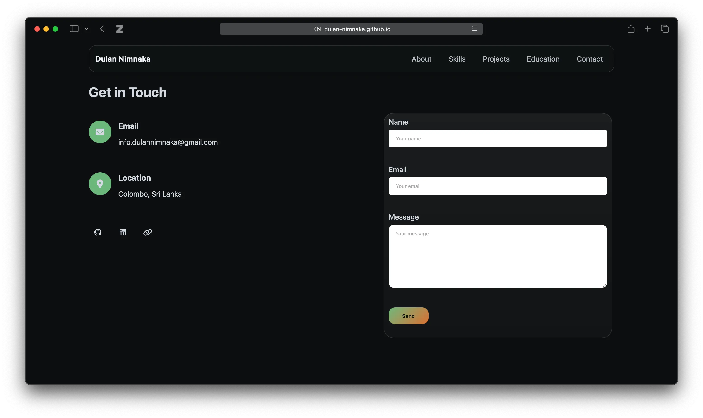

# Dulan Nimnaka - Portfolio Website

A modern, responsive portfolio website showcasing my skills, projects, and journey as a Computer Science student. Built with pure HTML, CSS, and JavaScript.

## 🚀 Live Demo

Check out the live website: [https://dulan-nimnaka.github.io/](https://dulan-nimnaka.github.io/)

## ✨ Features

- **Responsive Design** - Works seamlessly on desktop, tablet, and mobile
- **Modern UI/UX** - Clean glass-morphism design with smooth animations
- **Interactive Elements** - Typing animation, hover effects, and smooth scrolling
- **Project Showcase** - Dedicated section for projects with live demos and code links
- **Contact Form** - Functional contact form with Formspree integration
- **Education Timeline** - Visual timeline of academic journey

## 🛠️ Tech Stack

- **Frontend:** HTML5, CSS3, JavaScript (ES6+)
- **Styling:** CSS Grid, Flexbox, CSS Variables
- **Animations:** AOS (Animate On Scroll) library, custom CSS/JS animations
- **Icons:** Font Awesome, Devicon
- **Deployment:** GitHub Pages

## 📸 Screenshots

## 📞 Contact
[Email](info.dulannimnaka@gmail.com)
[LinkedIn](linkedin.com/in/dulannimnaka)
[GitHub](github.com/dulan-nimnaka)
[Portfolio](dulan-nimnaka.github.io)

## ✍️ Author
Dulan Nimnaka [ConnectMe](https://dulan-nimnaka.github.io/connectme/)

© 2025 Dulan Nimnaka. All rights reserved.
